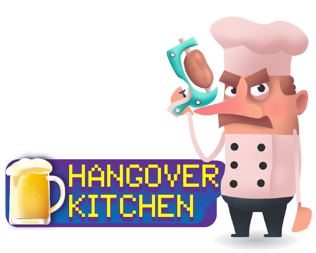

# LudumDare41 - Hangover Kitchen




Shooting meets Cooking in Hangover Kitchen. Improve your kitchen's Goggle review by shooting ingredients to the correct customer, completing recipes before they empty your beer stock. Keep your chef’s beer topped up by waking up (kicking out) the hungover customers with exotic food. If all of the beer is gone it's **Game Over.**


**Desktop Controls** .   
Move Up: Up Arrow Key.   
Move Down: Down Arrow Key.   
Fire potato Gun: Space Bar.   
    
**Mobile Controls**      
Move: Drag Chef .   
Fire potato Gun: Tap on screen.   


[Play Online Hosted Game](http://vibrant-murdock-3dc5dd.netlify.com)


### Run Locally;

```
npm i
npm start
```

and the game is available at [localhost:8080](http://localhost:8080)

